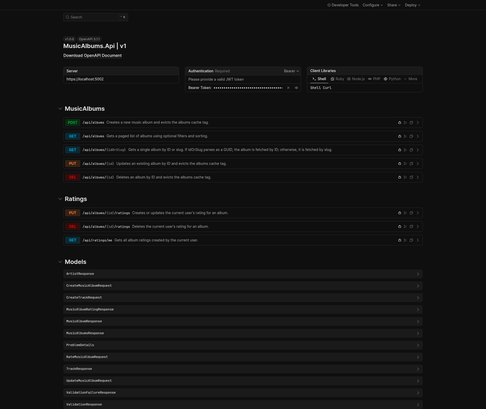
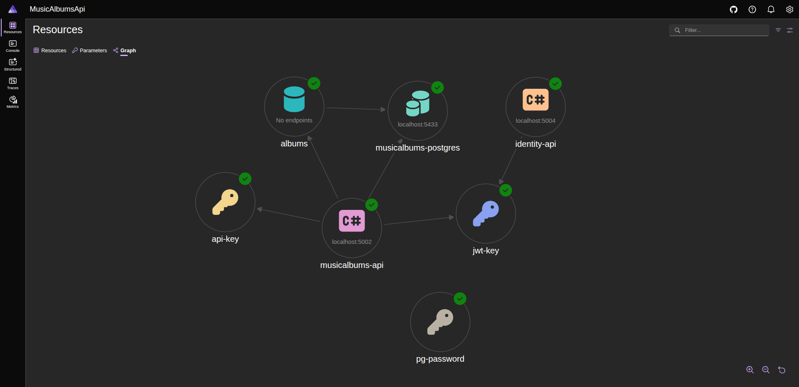
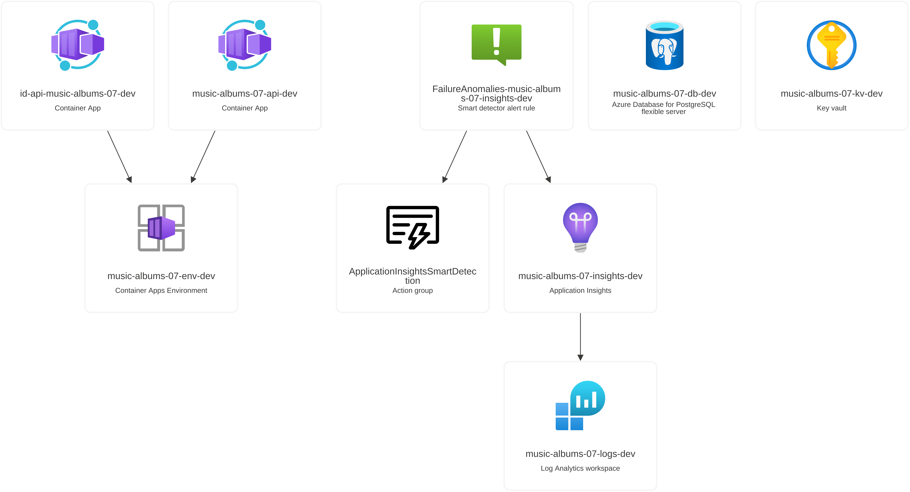
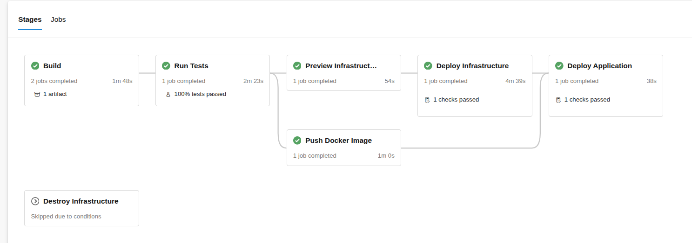
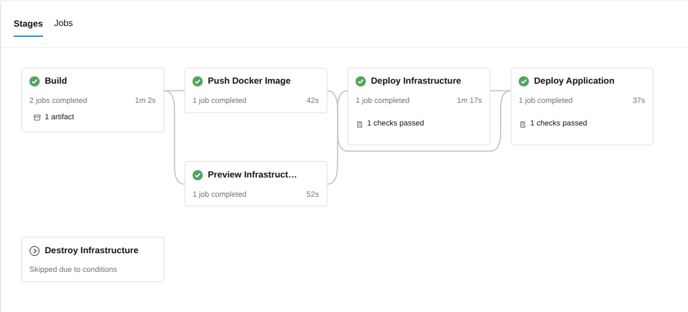

# Music Albums API

Music Albums REST API in .NET / C#, with Dapper and PostgreSQL. **Locally orchestrated by Aspire** and **deployed to Azure Container Apps** through Bicep's Infrastructure as Code (IaC) and Azure Pipelines CI/CD. Development follows **[GitHub Flow](docs/CONTRIBUTING.md)** — all changes go through PRs (direct push to `main` is not allowed), CI required, squash merge enforced.

This project is a **monolith** with a pragmatic **Layered Architecture**, organized by technical concerns:

- **`MusicAlbums.Api`** (Presentation): MVC Controllers, auth handlers, request/response mapping, health checks, and OpenAPI / Scalar configuration.
- **`MusicAlbums.Application`** (Business & Data): Core business logic (`Services`), data access (`Repositories` & `Database`), domain models, and input validation (`Validators`).
- **`MusicAlbums.Contracts`** (HTTP Contracts): Request and Response DTOs that define the API's public interface.
- **`MusicAlbums.ServiceDefaults`** (Shared Infrastructure): Cross-cutting runtime concerns — OpenTelemetry instrumentation, service discovery, HTTP client resilience. Referenced by both the API and the Identity API via `builder.AddServiceDefaults()`, and **runs in both local and cloud** — only the telemetry exporter changes (OTLP to the Aspire dashboard locally, Azure Monitor to Application Insights in production).

One additional project handles local orchestration only:

- **`MusicAlbums.AppHost`** — [.NET Aspire](https://learn.microsoft.com/en-us/dotnet/aspire/) orchestrator. Declares the local dev topology (PostgreSQL, the API, the Identity API helper) and is invoked by `aspire start`. **Local development only** — not built into the Docker image, not deployed to the cloud.

## 🌐 Live Demo

- **🔗 [Music Albums API — Scalar](https://music-albums-api-dev.happysand-f026cd85.swedencentral.azurecontainerapps.io/scalar/v1)**
- **🔗 [Identity API — Scalar](https://id-api-music-albums-dev.happysand-f026cd85.swedencentral.azurecontainerapps.io/scalar/v1)** (helper for generating JWTs)

> Development environment. Demo may scale to zero when idle — the first request can take a few seconds.

> The API reference UI was initially built on Swagger UI (Swashbuckle) and later migrated to [Scalar](https://scalar.com/) on top of .NET 10's built-in `Microsoft.AspNetCore.OpenApi` (OpenAPI 3.1).

## 📚 Documentation

- [Contributing](docs/CONTRIBUTING.md) - Git workflow, branch naming, PR requirements, deploy flow
- [Aspire Local Dev](docs/ASPIRE_LOCAL_DEV.md) - database, dashboard workflow, and startup commands
- [API Testing Guide](docs/API_TESTING_GUIDE.md) - copy-pastable requests for all endpoints
- [Infrastructure](docs/INFRASTRUCTURE.md) - Bicep modules and Azure resources
- [CI/CD](docs/CI_CD.md) - Azure Pipelines, service connections, variable groups, GitHub Actions
- [Identity API](docs/IDENTITY_API.md) - JWT token generator (helper tool)
- [Standalone Postgres](tools/local-postgres/README.md) - legacy `docker-compose` Postgres, kept for non-Aspire workflows

## 🚀 Local Development

Aspire is the local orchestrator. It brings up the API, the Identity API helper, and a persistent PostgreSQL container in one go — from the CLI (`aspire start`) or via F5 in your IDE.

See [Aspire Local Dev](docs/ASPIRE_LOCAL_DEV.md) for first-time setup, the daily workflow, supported IDEs, and the OpenTelemetry observability setup.

### Local orchestration (Aspire Resources Graph)

## ☁️ Cloud Deployment (Azure Container Apps)

| Dev | Prod |
|-----|------|
|  |  |

Two Azure Pipelines drive the cloud: `.azure-pipelines/main-ci-cd.yml` for the main API and infrastructure, and `.azure-pipelines/optional-identity-api.yml` for the Identity API helper.

### Identity API (optional helper)

The [Identity API](docs/IDENTITY_API.md) is a JWT token generator for testing. It is deployed into the **same resource group** as the main API and shares its Container Apps Environment, but its infrastructure is managed by its own pipeline so it can be deployed/destroyed independently.

See [Infrastructure](docs/INFRASTRUCTURE.md) for the deployment model and dev vs prod differences, and [CI/CD](docs/CI_CD.md) for pipeline parameters, service connections, and variable groups.

## 🩺 Health endpoints

- `/_health/live` - liveness probe (process is up; no dependency checks)
- `/_health/ready` - readiness probe (checks database connectivity)
