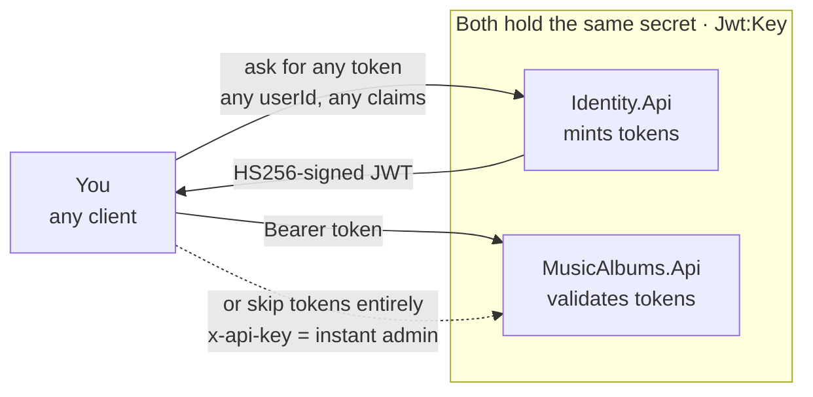
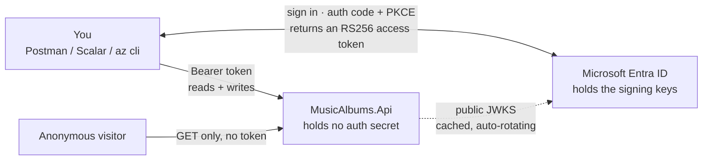
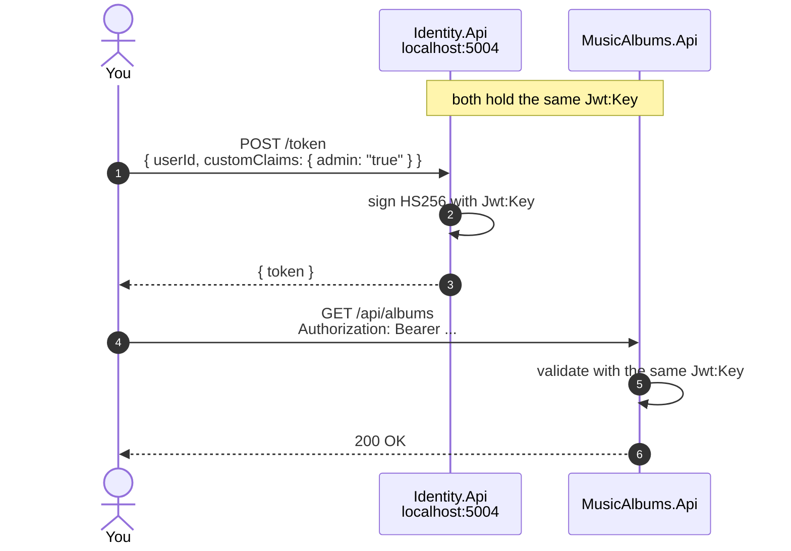
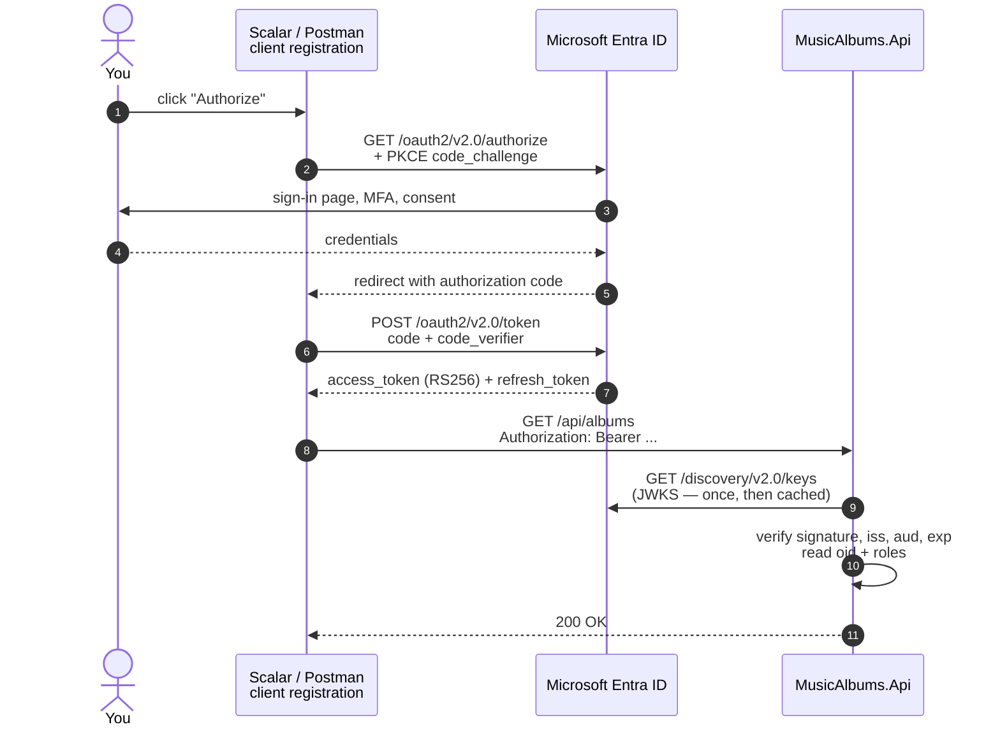

# Migrating to Microsoft Entra ID

Replacing the hand-rolled HS256 JWT scheme (and the [Identity API](IDENTITY_API.md) helper tool)
with Microsoft Entra ID as the token issuer.

This is a study-and-implement guide, not a copy-paste script. Each phase states what to
build and how to verify it, so the implementation work stays hands-on.

## Table of contents

- [Why, and what actually changes](#why-and-what-actually-changes)
- [Current state](#current-state)
- [Concepts you need first](#concepts-you-need-first)
- [Reading list](#reading-list)
- [Access model](#access-model)
- [App registrations](#app-registrations)
- [Getting tokens](#getting-tokens)
- [Local vs dev vs prod](#local-vs-dev-vs-prod)
- [Migration phases](#migration-phases)
- [Gotchas](#gotchas)
- [Deferred decisions](#deferred-decisions)

---

## Why, and what actually changes

Today the API and the Identity API share a symmetric secret. Whoever holds `Jwt:Key` can
mint any token, for any user, with any claim. The secret lives in Key Vault, in two Azure
DevOps variable groups, and in local user-secrets.

With Entra, tokens are signed with an asymmetric key held by Microsoft. The API only ever
holds **public** configuration — tenant ID, client ID, audience — and downloads the signing
keys from a public JWKS endpoint. The API stops being able to mint tokens at all, which is
the point.

| | Today | With Entra |
|---|---|---|
| **Signature** | HS256, shared secret | RS256, JWKS, auto-rotating |
| **Issuer** | `MusicAlbumsIdentity` | `https://login.microsoftonline.com/{tenantId}/v2.0` |
| **Audience** | `MusicAlbumsApi` | `api://{apiClientId}` |
| **User identity** | custom `userid` claim | `oid` (+ `tid`) |
| **Roles** | `admin` / `trusted_member` claims | App Roles → `roles` claim |
| **Admin backdoor** | `x-api-key` static header | deleted |
| **Secrets in the API** | `Jwt:Key`, `ApiKey` | **none** |
| **Token lifetime** | 8h fixed, no revocation | Entra-managed, revocable, CAE-capable |

### Before

Everything hangs off one symmetric secret. The Identity API and the Music Albums API both
hold `Jwt:Key`; either could mint a token for any user with any claim. The `x-api-key`
header is a second, independent path to admin that bypasses tokens entirely.



Both secrets come from Key Vault, and the same `Jwt:Key` is injected into both services.

### After

The API becomes a pure resource server. It holds no secret, cannot mint tokens, and
validates signatures against Microsoft's public keys. There is one way in, and it starts
with a real sign-in.



Key Vault is still there, holding the PostgreSQL credentials — it just stops holding
anything to do with authentication.

> **`Azure.Identity` is not part of this.** It handles *outbound* auth — your app getting a
> token to call an Azure service. This repo already uses that pattern: the Container App
> authenticates to PostgreSQL via managed identity
> ([`database.bicep`](../infra/main/modules/database.bicep), `activeDirectoryAuth: 'Enabled'`).
> For *inbound* auth — validating tokens presented to your API — the library is
> `Microsoft.Identity.Web`. Two different directions, two different packages.

---

## Current state

What exists now, so you know exactly what you are replacing.

**Token validation** — [`Program.cs`](../src/MusicAlbums.Api/Program.cs), `AddJwtBearer`.
All four validations are enabled (`ValidateIssuer`, `ValidateAudience`, `ValidateLifetime`,
`ValidateIssuerSigningKey`). This part is correct and the shape carries over.

**Identity** — [`IdentityExtensions.cs`](../src/MusicAlbums.Api/Auth/IdentityExtensions.cs)
reads a non-standard `userid` claim. Every controller goes through
`HttpContext.GetUserId()`, so there is exactly one place to change. Good.

**Authorization** — two policies in `Program.cs`: `Admin` (via `AdminAuthHandler`) and
`Trusted` (an inline assertion over the `admin` / `trusted_member` claims).

**Storage** — `ratings.user_id` is `UUID`
([`DbInitializer.cs:202`](../src/MusicAlbums.Application/Database/DbInitializer.cs#L202)).
The Entra `oid` is also a GUID, so **the column type survives the migration unchanged** —
only the values differ. Existing rows will point at orphaned IDs; for a demo dataset,
truncating the ratings table is the honest answer.

### Problems to fix on the way

**The API key admin backdoor.**
[`AdminAuthHandler.cs:33-42`](../src/MusicAlbums.Api/Auth/AdminAuthHandler.cs#L33-L42):
a request carrying the right `x-api-key` header is granted admin, and the handler
*fabricates* an identity with a hardcoded GUID. A static shared secret granting full admin,
with no user behind it, no expiry, and no revocation. The comparison is also not
constant-time. This is the single worst thing in the current design. Nothing in the repo
calls it, so it is simply deleted — there is no replacement to build.

**Dead code.** `ApiKeyAuthFilter` is registered in `Program.cs` but applied to no controller.

**`sub` misuse.**
[`IdentityController.cs:59`](../tools/Identity.Api/Controllers/IdentityController.cs#L59)
puts the email in `sub`. `sub` is a subject identifier, not a contact address.

**No auth tests.** Nothing under `tests/` exercises authentication or authorization — the
integration tests only hit the anonymous `GET` endpoint. You would be migrating without a
safety net. Fixing this is Phase 0 and it is not optional.

**Legacy handler.** The Identity API uses `JwtSecurityTokenHandler`; the current one is
`JsonWebTokenHandler`. Moot once the tool is deleted.

---

## Concepts you need first

Four things. If these are solid, the rest is configuration.

### 1. Two app registrations, not one

This is the biggest mental shift from a shared secret. An app registration is not "my
project" — it is one identity in the directory.

- The **API registration** represents the resource being protected. It defines the
  audience (`api://{clientId}`), exposes scopes, and declares app roles. It never holds a
  secret in this design.
- A **client registration** represents each thing that requests tokens — Scalar, Postman,
  later a frontend. Each has its own redirect URIs and its own permissions on the API.

A token is minted *by* a client, *for* an audience, *on behalf of* a user.

### 2. Scopes vs roles

Both end up as authorization checks, but they answer different questions.

| | `scp` (scopes) | `roles` (app roles) |
|---|---|---|
| **Question** | What did the user let this client do on their behalf? | What is this user allowed to do? |
| **Granted via** | User or admin consent | Role assignment in the directory |
| **Check with** | `[RequiredScope("access_as_user")]` | `[Authorize(Roles = "Admin")]` |

Your `admin` / `trusted_member` claims map to **app roles**.

The distinction matters because they are independent: a client can hold the scope to act on
your behalf while you personally lack the role to perform the action. Both must pass.

### 3. `oid`, not `sub`

In Entra v2 tokens `sub` is **pairwise** — the same human gets a different `sub` per
application. It is useless as a cross-application key.

`oid` is the immutable object ID of the user within the tenant. The documented unique key
is the pair **`tid` + `oid`**. Single-tenant means `tid` is constant, so `oid` alone is
sufficient here — but know why, because it stops being true the moment you go multi-tenant.

`GetUserId()` becomes a read of `oid`.

### 4. Access tokens, not ID tokens

An ID token says "this user signed in" and is for the *client* to consume. An access token
says "the bearer may call this API" and is for the *API*. Your API validates access tokens
only. Sending an ID token to the API must fail — and it will, on the audience check.

---

## Reading list

### Part 1 — Vendor-neutral fundamentals

These are the concepts every identity system uses; Entra is one implementation of them.
Worth doing first, because the Microsoft docs assume you already have this vocabulary.

| Term | What it actually is |
|---|---|
| **OAuth 2.0** | A framework for *delegated authorization* — letting an app act on your behalf without knowing your password. Not authentication. |
| **OIDC** | OpenID Connect. A thin identity layer *on top of* OAuth 2.0. It adds the ID token, and answers "who is this user". |
| **JWT** | Just a token *format*: header, payload, signature, base64url-joined by dots. Independent of OAuth — you can use JWTs with no OAuth at all, which is exactly what this repo does today. |
| **Bearer** | How the token travels: `Authorization: Bearer <token>`. "Bearer" means possession is enough — whoever holds it can use it, like cash. Hence HTTPS and short lifetimes. |
| **PKCE** | Proof Key for Code Exchange. Stops a stolen authorization code from being redeemed by an attacker. Mandatory for clients that cannot keep a secret (browsers, mobile, Scalar). |
| **JWKS** | The public keys an issuer publishes so anyone can verify its signatures without a shared secret. |
| **SAML** | The older XML-based SSO protocol. Still everywhere in corporate intranets. **You will not use it here** — know it exists and that it solves the same problem as OIDC. |

Read in this order:

1. **[OAuth 2.0 — oauth.net](https://oauth.net/2/)** — the canonical concise hub. Read the
   landing page plus *Access Tokens*, *Scope*, *Client Types*, and
   *[Authorization Code + PKCE](https://oauth.net/2/pkce/)*. Skip the other grant types.
   ~1h.
2. **[How OpenID Connect works](https://openid.net/developers/how-connect-works/)** — what
   OIDC adds on top of OAuth, and why the two are constantly confused. ~20min.
3. **[Introduction to JSON Web Tokens](https://jwt.io/introduction)** — the format itself,
   and the signing/verification model. You already use JWTs, so this is mostly
   confirmation. ~20min.
4. *(optional, high value)* **[OAuth 2.0 and OpenID Connect in plain English](https://www.youtube.com/watch?v=996OiexHze0)** —
   Nate Barbettini. One hour of video that replaces about ten articles. If you only do one
   item in Part 1, do this one.

For reference rather than reading: the specs are
[RFC 6749](https://datatracker.ietf.org/doc/html/rfc6749) (OAuth 2.0),
[RFC 6750](https://datatracker.ietf.org/doc/html/rfc6750) (Bearer),
[RFC 7519](https://datatracker.ietf.org/doc/html/rfc7519) (JWT) and
[RFC 7636](https://datatracker.ietf.org/doc/html/rfc7636) (PKCE). Look things up in them;
do not read them front to back.

### Part 2 — Entra specifics

Ordered. Stop at 4; the rest of the internet is noise for this task.

1. **[Protected web API — scenario overview](https://learn.microsoft.com/en-us/entra/identity-platform/scenario-protected-web-api-overview)**
   plus its four sub-articles (app registration → app configuration → code configuration →
   verify scopes and app roles). This is the core. ~2h.
2. **[Access token claims reference](https://learn.microsoft.com/en-us/entra/identity-platform/access-token-claims-reference)** —
   `oid`, `sub`, `scp`, `roles`, `azp`, `tid`, `ver`. Answers most audience/issuer/user
   questions on its own. ~30min.
3. **[How to add app roles](https://learn.microsoft.com/en-us/entra/identity-platform/howto-add-app-roles-in-apps)** —
   the replacement for the `admin` / `trusted_member` claims. ~30min.
4. **[Authorization code flow + PKCE](https://learn.microsoft.com/en-us/entra/identity-platform/v2-oauth2-auth-code-flow)** —
   the only flow this project uses. ~40min.

**On the AZ-204 learning path:** still online (content dated 2021, last touched 2025-08),
but only modules 1 and 2 are relevant — modules 3 (SAS) and 4 (Graph) are not. It is
MSAL- and client-centric, so it under-serves the "protect an API" case regardless of the
certification's status. Item 1 above is the better entry point.

**On [aspnet/core/security/authentication/azure-active-directory](https://learn.microsoft.com/en-us/aspnet/core/security/authentication/azure-active-directory/):**
a 109-word link hub. Use as an index, nothing more.

**On [Container Apps built-in auth (Easy Auth)](https://learn.microsoft.com/en-us/azure/container-apps/authentication-entra):**
read it to understand why this repo does *not* use it. It validates at the ingress, is
configured through the portal, requires a client secret, and — per that same page — does not
validate app roles for you. In-app validation keeps the logic in code and Bicep, which is
both more portable and more legible in a portfolio.

---

## Access model

Public read, authenticated write. This is what the code already does — the migration
changes *who issues the token*, not who is allowed to do what.

| Endpoint | Access |
|---|---|
| `GET /albums`, `GET /albums/{idOrSlug}` | Anonymous |
| `POST /albums`, `PUT /albums/{id}` | `TrustedMember` role |
| `DELETE /albums/{id}` | `Admin` role |
| Rate album, delete rating, list own ratings | Any authenticated user |

Anonymous visitors on the public Scalar pages can exercise the read endpoints. Write access
is granted per person, by role assignment in the directory — the same way it works in any
real system. There are no shared demo credentials, and the demo database therefore needs no
reset job and no vandalism mitigations.

### Making the auth legible without granting access

If the public can only issue `GET`s, the authorization work has to be visible some other
way. Four cheap signals:

1. **Scalar renders lock icons** on protected operations, and an anonymous write returns a
   clean **401**.
2. **401 vs 403 are distinct.** No token is a 401; a valid token with the wrong role is a
   403. That distinction is the difference between real authorization and a decorative
   `[Authorize]`.
3. **Integration tests assert the role matrix** and run in CI. For a technical reviewer
   this is the strongest evidence available, and it lives in the repo.
4. **Keep the Scalar `Authorize` button wired up.** It is how you demo the flow live, and
   how anyone you grant access actually signs in.

### When a frontend arrives

Nothing here is throwaway. This API is a resource server: it validates tokens for one
audience, and clients are separate registrations. Adding a frontend means adding one more
client registration that requests the same scope — **the API does not change.**

A browser frontend uses the **same flow as Scalar** — authorization code + PKCE, on behalf
of a signed-in user. It cannot hold a secret, so PKCE is not optional for it. This is true
whether it is served from the same Container App or from Netlify / GitHub Pages.

**What hosting *does* affect is CORS.** Same-origin (frontend served by the same Container
App) needs nothing. A different origin (Netlify, GitHub Pages) makes CORS mandatory — and
CORS is currently commented out in
[`Program.cs`](../src/MusicAlbums.Api/Program.cs#L87-L95). The commented block uses
`AllowAnyOrigin()`, which is incompatible with credentialed requests; a real frontend needs
explicit `WithOrigins(...)` plus the `Authorization` header allowed. This is orthogonal to
Entra — it would apply to any auth scheme.

That is also the point at which
[Microsoft Entra External ID](https://learn.microsoft.com/en-us/entra/external-id/customers/overview-customers-ciam)
becomes worth considering, if self-service sign-up is ever wanted. It is the CIAM product —
self-service registration, social identity providers, custom branding — and it is premature
for a backend-only API whose only UI is an API reference page. Migrating later means
pointing the `AzureAd` configuration at a different tenant, not rewriting anything.

## App registrations

Two registrations. Create them with `az ad app` so they are reproducible and reviewable,
not through portal clicks.

### A. The API — `music-albums-api-{env}`

- **Expose an API** → Application ID URI: `api://{clientId}`
- **Add a scope**: `access_as_user`, admin-consent-only or user-consentable as you prefer
- **App roles** (replacing the current claims):

  | Display name | Value | Allowed member types |
  |---|---|---|
  | Trusted Member | `TrustedMember` | Users/Groups |
  | Administrator | `Admin` | Users/Groups |

  Assign `Admin` and `TrustedMember` to named people only — you, and anyone you deliberately
  grant access to. A signed-in user with no role assigned can still rate albums, because the
  rating endpoints require authentication but no role.

- **Manifest**: set `accessTokenAcceptedVersion: 2`. Non-negotiable — see
  [Gotchas](#gotchas).
- **Authorized client applications**: pre-authorize the Scalar and Postman client IDs, and
  the Azure CLI (`04b07795-8ddb-461a-bbee-02f9e1bf7b46`) if you want
  `az account get-access-token` to work.

No client secret. The API never needs one.

### B. Interactive clients — `music-albums-scalar`, `music-albums-postman`

Public clients, PKCE, **no secret**. Register the redirect URIs under the **SPA** platform,
not Web — the Web platform expects a secret and rejects PKCE-only flows.

| Client | Redirect URI |
|---|---|
| Postman | `https://oauth.pstmn.io/v1/callback` |
| Scalar (local) | `https://localhost:5002/scalar/v1` |
| Scalar (dev) | `https://{dev-fqdn}/scalar/v1` |
| Scalar (prod) | `https://{prod-fqdn}/scalar/v1` — only if Scalar stays public in prod |

Every environment whose Scalar page you want to sign in from needs its redirect URI
registered. A missing one fails at the redirect with `AADSTS50011`, after a successful
sign-in — which reads like an API problem but is not.

Whether the prod row applies depends on the `ASPNETCORE_ENVIRONMENT` decision in
[The local development loop](#the-local-development-loop).

API permissions → My APIs → the API registration → delegated → `access_as_user`.

---

## Getting tokens

Yes — you stop calling your own `/token` endpoint and start calling Microsoft. Below,
`{tenantId}` is your directory ID and `{apiClientId}` is the API registration's client ID.

The two Entra endpoints you will use:

```
https://login.microsoftonline.com/{tenantId}/oauth2/v2.0/authorize
https://login.microsoftonline.com/{tenantId}/oauth2/v2.0/token
```

The response is JSON with an `access_token` field. That value goes into
`Authorization: Bearer ...`, exactly as today. The header does not change — only where the
token comes from.

### The shape of the change

Today, one hop against your own service:



Note what makes this a toy: *you* chose the `userId` and *you* chose the claims. Nothing
authenticated anything.

After — a real sign-in, and claims the caller cannot choose:



Step 9 happens once and is then cached — fetching the signing keys is not a per-request
round trip to Entra. Step 8 onwards is what every subsequent call looks like.

### Fastest loop: Azure CLI

For curl and quick manual checks, this is the shortest path:

```bash
az login
TOKEN=$(az account get-access-token \
  --scope "api://{apiClientId}/.default" \
  --query accessToken -o tsv)

curl -H "Authorization: Bearer $TOKEN" https://localhost:5002/api/albums
```

Requires the Azure CLI client ID to be pre-authorized on the API registration (see A above),
otherwise you get `AADSTS65001`. The token carries *your* user identity — your `oid`, and
whatever app roles you assigned yourself.

### Scalar and Postman: authorization code + PKCE

This is the flow that gives you a real sign-in screen and a user-bearing token.

**Postman** — on the collection, Authorization tab, type OAuth 2.0:

| Field | Value |
|---|---|
| Grant type | Authorization Code (With PKCE) |
| Callback URL | `https://oauth.pstmn.io/v1/callback` |
| Auth URL | `https://login.microsoftonline.com/{tenantId}/oauth2/v2.0/authorize` |
| Access Token URL | `https://login.microsoftonline.com/{tenantId}/oauth2/v2.0/token` |
| Client ID | the **Postman** registration's client ID |
| Client Secret | *(empty)* |
| Scope | `api://{apiClientId}/access_as_user openid profile offline_access` |
| Client Authentication | Send as Basic Auth header |

Set it once at collection level and every request inherits it. `offline_access` gets you a
refresh token so Postman can renew silently instead of re-prompting.

**Scalar** — replace the current `http`/`bearer` scheme in
[`BearerSecurityTransformer.cs`](../src/MusicAlbums.Api/OpenApi/BearerSecurityTransformer.cs)
with an `oauth2` scheme declaring the authorization-code flow and the same two URLs, then
configure the client ID via `AddPreferredSecuritySchemes` / the OAuth2 options in
`MapScalarApiReference`. Scalar then renders a sign-in button and attaches the token itself.

### Inspect what you got

Decode the token — [jwt.ms](https://jwt.ms) is Microsoft's own decoder — and check `aud`,
`iss`, `oid`, `roles`, `scp`, and `ver` before blaming your API code. Nine times out of ten
the 401 is visible right there.

### What happens to the old secrets

| Secret | Fate |
|---|---|
| `Jwt:Key` | **Deleted.** Remove from `security.bicep`, `compute.bicep`, both variable groups, AppHost, and local user-secrets. The API validates with public keys. |
| `ApiKey` | **Deleted.** Nothing calls it; the admin backdoor it enabled goes with it. |
| New secrets in the API | **None.** Tenant ID, client ID and audience are all public config. |

That is the headline result: **the API ends up holding zero secrets for authentication.**

---

## Local vs dev vs prod

### One tenant, three API registrations

Use a single Entra tenant with a separate API registration per environment:

| Environment | Registration | Audience |
|---|---|---|
| Local | `music-albums-api-local` | `api://{localClientId}` |
| Dev | `music-albums-api-dev` | `api://{devClientId}` |
| Prod | `music-albums-api-prod` | `api://{prodClientId}` |

Distinct audiences are what isolate the environments: a token minted for local is rejected
by prod on the `aud` check, for free. Separate *tenants* per environment would be stricter
still, but that is real overhead for little gain here.

Each environment is sealed off from the others by its audience. A token minted against the
local registration carries `aud: api://local-id`, so prod rejects it on the audience check
without any extra work on your part — that is the whole reason for three registrations
rather than one.

Do **not** share one registration across all three. It would mean a token from your laptop
is valid against production.

### Configuration per environment

The API needs only this, and none of it is secret:

```json
{
  "AzureAd": {
    "Instance": "https://login.microsoftonline.com/",
    "TenantId": "{tenantId}",
    "ClientId": "{apiClientId}",
    "Audience": "api://{apiClientId}"
  }
}
```

Where each environment gets it from:

- **Local** — [`AppHost.cs`](../src/MusicAlbums.AppHost/AppHost.cs): replace the three
  `Jwt:*` `WithEnvironment` calls with `AzureAd:*` ones. Plain literals, no
  `AddParameterFromConfiguration(secret: true)`, no user-secrets — because nothing here is
  a secret. Same for the `jwt-key` parameter.
- **Dev / prod** — [`compute.bicep`](../infra/main/modules/compute.bicep): the `Jwt__Key`
  `secretRef` env var becomes plain `AzureAd__*` `value` entries. The `jwt-key` and
  `api-key` secret blocks and their Key Vault references go away, as do
  `secretJwtKey`/`secretApiKey` in [`security.bicep`](../infra/main/modules/security.bicep).
- **Pipeline** — [`main-ci-cd.yml`](../.azure-pipelines/main-ci-cd.yml) passes
  `jwtKey='$(jwt-key)'` and `apiKey='$(api-key)'` at lines 363-364 and 430-431 (what-if and
  deploy). Drop both, add the `AzureAd` parameters, and remove `JWT_KEY`/`API_KEY` from the
  `music-albums-dev` and `music-albums-prod` variable groups.

Key Vault stays — PostgreSQL admin credentials still live there. It just stops holding auth
secrets.

### The local development loop

This is the part that actually bites, and it is worth deciding before you start rather than
discovering at Phase 4: **you cannot mint Entra tokens offline.** Deleting the Identity API
means no more `curl localhost:5004/token` on a plane.

> ### ⚠️ Fix `ASPNETCORE_ENVIRONMENT` before writing any `IsDevelopment()` guard
>
> [`main-ci-cd.yml:66-67`](../.azure-pipelines/main-ci-cd.yml#L66-L67) sets
> `aspNetCoreEnvironment: "Development"` once, with **no per-environment override** — so
> production runs as `Development` and `IsDevelopment()` returns `true` there. A
> Development-only test auth scheme would be live in prod.
>
> The fix is three lines: a per-environment override in the pipeline. Do it in Phase 0.
> The knock-on question — Scalar disappears from prod — is
> [deferred to the end](#deferred-decisions); it needs no answer now.

Three answers, and you want two of them:

1. **`az account get-access-token`** for day-to-day manual work. Needs `az login` and
   connectivity, but no extra moving parts. This is the default loop.
2. **A `Development`-only test authentication scheme** for offline work — a handler that
   trusts a locally-signed token or a fixed set of claims, registered *only* when
   `IsDevelopment()`. Read the warning above first: that guard is currently meaningless in
   this repo. Fix the environment variable, then rely on it.
3. **Not real Entra in integration tests.** CI must not depend on a live tenant — it would
   be slow, flaky, and would need credentials in the pipeline. The containerized Aspire
   tests should register a test auth handler that mints claims in-process. This is also why
   Phase 0 exists: those tests are what tell you the migration worked.

### Per-environment checklist

Work through this once per environment. Prod differs from dev only in the last three rows.

| | Local | Dev | Prod |
|---|---|---|---|
| API app registration created | ✅ | ✅ | ✅ |
| `accessTokenAcceptedVersion: 2` | ✅ | ✅ | ✅ |
| App roles defined | ✅ | ✅ | ✅ |
| Scalar redirect URI registered | `localhost:5002` | dev FQDN | prod FQDN, if public |
| `AzureAd:*` config set | `AppHost.cs` | `compute.bicep` | `compute.bicep` |
| `jwt-key` / `api-key` removed | user-secrets | Key Vault + var group | Key Vault + var group |
| `ASPNETCORE_ENVIRONMENT` correct | `Development` | `Development` | **`Production`** — fix in Phase 0 |
| Roles assigned to people | you | you + testers | you only |

Keep prod role assignments deliberately narrow. `Admin` on prod means the ability to delete
albums from the live database.

---

## Migration phases

Sequenced so `main` stays green throughout. Each phase is independently mergeable.

### Phase 0 — Clean up and build the safety net

- Remove the API-key branch from `AdminAuthHandler`, including the hardcoded GUID.
- Delete `ApiKeyAuthFilter` (dead code) and its registration.
- Remove the redundant `AddSingleton<IConfiguration>` in `Program.cs`.
- **Fix `aspNetCoreEnvironment` in the pipeline** so prod deploys as `Production` — see the
  warning in [The local development loop](#the-local-development-loop). Do it now, in
  Phase 0, because Phase 4 depends on that guard being real.
- **Write authorization tests against the current HS256 setup**: anonymous is rejected,
  a `trusted_member` token passes `Trusted` and fails `Admin`, an `admin` token passes both,
  an expired token is rejected, a wrong-audience token is rejected, a wrong-issuer token is
  rejected.

Those tests are the contract. If they still pass after Phase 3 with Entra tokens, the
migration is correct. Do not skip this.

### Phase 1 — Make the scheme swappable

- Extract the auth wiring into an `AddApiAuthentication(this IHostApplicationBuilder)`
  extension so `Program.cs` has one call.
- Keep every claim read behind `GetUserId()` — it already is, so protect that property.

No behaviour change. Pure refactor, tests unchanged.

### Phase 2 — Create the registrations

Scripted with `az ad app`, committed under `infra/`. API registration, app roles,
`accessTokenAcceptedVersion: 2`, exposed scope, pre-authorized clients. No code changes
yet — verify by acquiring a token with the Azure CLI and decoding it on jwt.ms.

**Done when:** a decoded token shows the right `aud`, `iss`, `ver: 2`, and your `roles`.

### Phase 3 — Swap the validation

The [access model](#access-model) does not change in this phase — the same endpoints stay
anonymous and the same ones stay protected. Only the token issuer and the claim names move.

- Add `Microsoft.Identity.Web`, call `AddMicrosoftIdentityWebApi` against the `AzureAd`
  section.
- `GetUserId()` reads `oid`.
- Policies become role checks: `Trusted` → `Admin` or `TrustedMember` role;
  `Admin` → `Admin` role. `AdminAuthHandler` and `AdminAuthRequirement` are deleted —
  `RequireRole` covers it.
- Add `[RequiredScope("access_as_user")]` on the protected endpoints, so a token issued for
  a different purpose cannot be replayed against this API.
- Keep both schemes registered briefly if you want a soft cutover.

**Done when:** the Phase 0 tests pass with Entra-shaped tokens.

### Phase 4 — Local development loop

Azure CLI flow documented, plus the Development-only test scheme, plus the test auth
handler for integration tests. See [above](#the-local-development-loop).

### Phase 5 — Scalar OAuth2

Rewrite `BearerSecurityTransformer` to emit an `oauth2` scheme, wire the Scalar client ID,
register the redirect URI as **SPA**.

**Done when:** you can sign in from the Scalar UI and call a protected endpoint without
pasting a token by hand.

### Phase 6 — Delete the Identity API

Seven places reference it:

- `src/MusicAlbums.AppHost/AppHost.cs` — the `identity-api` resource and its endpoints
- `MusicAlbumsApi.slnx` — the project entry (and fix the stale Postman path while there)
- `infra/optional-identity-api-helper-tool/` — the whole directory
- `.azure-pipelines/optional-identity-api.yml` — the pipeline
- `docs/IDENTITY_API.md` — delete
- `docs/API_TESTING_GUIDE.md` — the whole "Get a Token" section, and the token placeholders
  throughout
- `README.md` — the JWT badge, the Identity API live-demo link, the "Identity API (optional
  helper)" section, the architecture bullet mentioning it, and the docs index entry

Also delete the Azure resources and the now-unused Key Vault secrets.

---

## Gotchas

The ones that cost hours.

**`accessTokenAcceptedVersion` defaults to `null`, meaning v1.** You get tokens with issuer
`https://sts.windows.net/{tid}/` instead of `.../v2.0`, and a different claim shape. Set it
to `2` in the manifest and confirm `ver: 2` in the decoded token.

**.NET remaps inbound claims by default.** `oid` arrives as
`http://schemas.microsoft.com/identity/claims/objectidentifier` and roles as the long
`ClaimTypes.Role` URI. This is the number one cause of "my `RequireRole` does nothing".
Either set `MapInboundClaims = false` and read the short names, or set `RoleClaimType`
explicitly. Verify by dumping `User.Claims` once — do not assume.

**Audience can legitimately be either form.** Depending on how the client requested the
token, `aud` may be `api://{clientId}` or the bare `{clientId}` GUID. Accept both, or pin
one and be consistent about how clients request.

**Redirect URIs must be registered as SPA for PKCE.** Registering under the Web platform
makes Entra demand a client secret and reject the PKCE-only flow. The error message does
not say this.

**`sub` is pairwise.** Covered above, repeated because it is silently wrong rather than
loudly broken: use `oid`.

**ID token ≠ access token.** If a client sends an ID token the audience check rejects it —
which is correct, but the resulting 401 looks identical to a config problem.

**Consent.** A scope may need admin consent before any token is issued. If every request
fails identically regardless of user, check consent before debugging code.

---

## Deferred decisions

Park these until the migration works. None of them block anything.

### Scalar in production

Setting prod to `ASPNETCORE_ENVIRONMENT=Production` removes Scalar and `MapOpenApi` from
prod, because they sit inside the same `IsDevelopment()` block.

**Recommendation: let it disappear, and add nothing back.**

Three reasons:

1. **Dev is already the public face.** Both live-demo links in the README point at the dev
   FQDN, not prod. Nothing breaks, and no README edit is needed.
2. **Prod is spun up only occasionally** — the VNet and private endpoints in the prod
   topology consume the monthly free Azure allowance quickly, so it is not a permanent
   environment. An interactive docs page on an environment that is usually off is not worth
   engineering around.
3. **It is the more honest story.** Real production APIs do not serve interactive
   documentation publicly. "Dev carries the interactive reference; prod is locked down like
   a real production environment" reads better in a portfolio than an environment that
   claims to be Development in order to keep a docs page.

This costs zero work: fix the pipeline variable and stop there. Only if you later decide
prod must serve Scalar do you need to lift it out of the `IsDevelopment()` block behind its
own configuration flag — and at that point it is a deliberate choice rather than a side
effect.

### Scoping album writes to their creator

Currently any `TrustedMember` can edit or delete any album. Restricting mutations to the
album's creator is better API design and would matter if write access were ever widened
beyond people you personally trust. Not required while write access is granted by named
role assignment.

### Stale solution reference

`MusicAlbumsApi.slnx` points at `tools/MusicAlbumsApi.postman_collection.json`; the file on
disk is `tools/Music Albums API - Complete Testing Suite.postman_collection.json`. Fix it
whenever you next touch the solution file.
